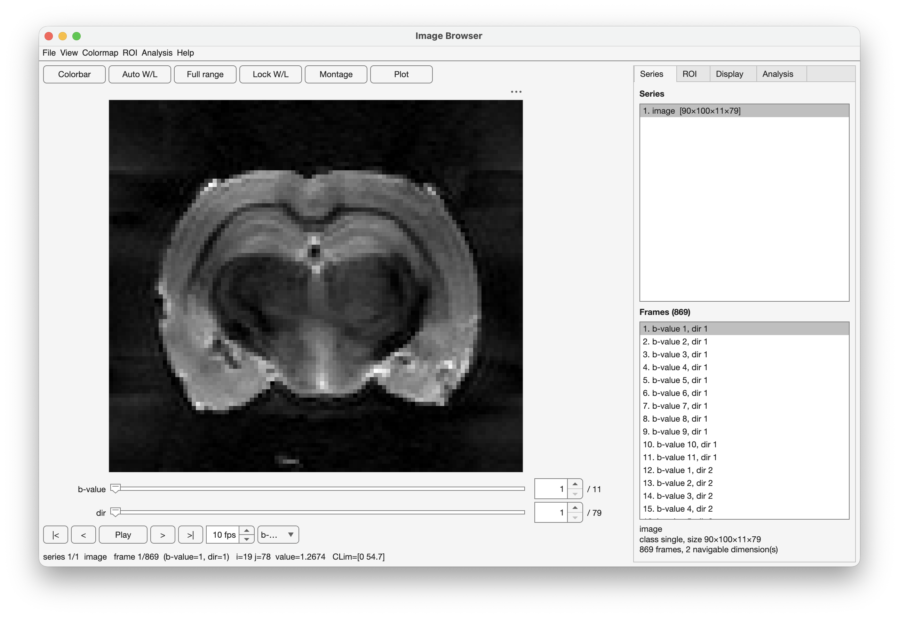
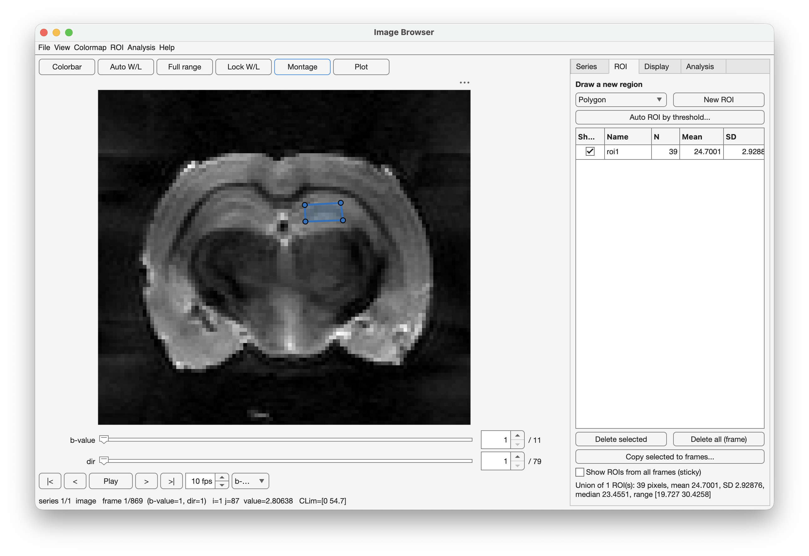
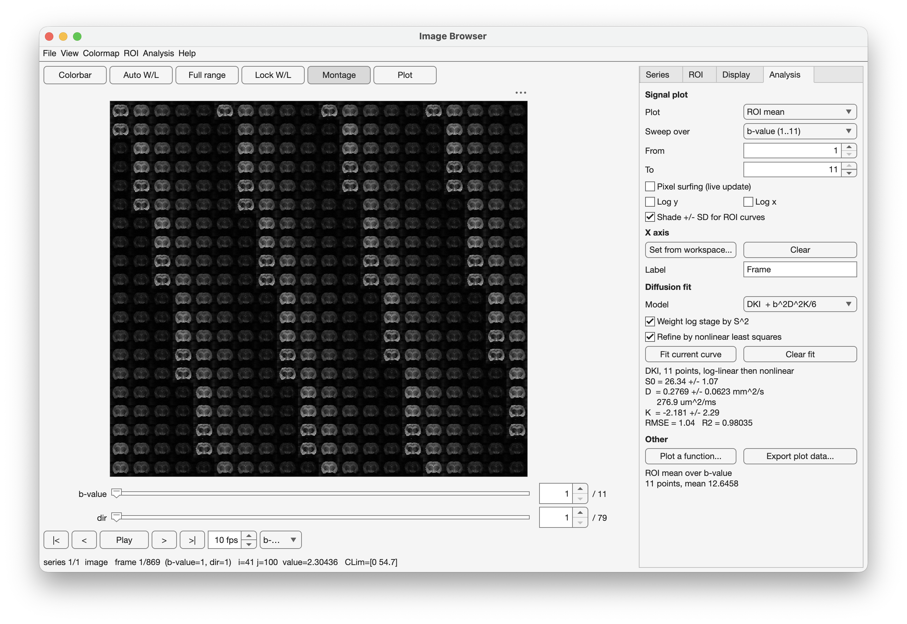
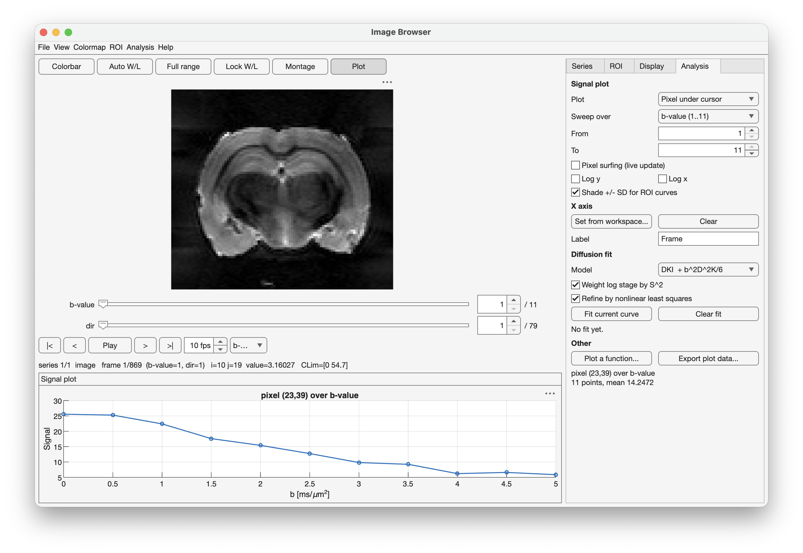
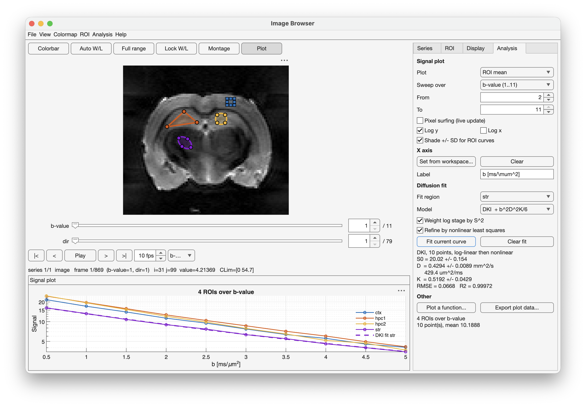

# ib: An imagebrowser 

A MATLAB app for browsing series of images, drawing regions of interest, and
extracting signal curves — built for MRI data, useful for any stack of images.

Point it at an N-dimensional array and it gives you a slider per dimension, so a
`128 x 128 x
 30 x 163` diffusion dataset navigates as *slice* and *volume*
rather than as 4890 undifferentiated frames. Draw a ROI, and the signal across
volumes appears in a docked plot. If your x-axis is b-values, it will fit DTI or
DKI to that curve.

```matlab
ib(vol,'XData',unique(bs),XLabel='b [ms/\mum^2]',DimNames=["b-value","dir"])
```



---

## Contents

- [Installation](#installation)
- [Quick start](#quick-start)
- [The interface](#the-interface)
- [Keyboard and mouse](#keyboard-and-mouse)
- [Regions of interest](#regions-of-interest)
- [Signal curves](#signal-curves)
- [DTI and DKI fitting](#dti-and-dki-fitting)
- [Overlays](#overlays)
- [Export](#export)
- [Command-line API](#command-line-api)
- [Feature reference](#feature-reference)
- [Requirements](#requirements)
- [Testing](#testing)
- [Known limitations](#known-limitations)
- [Acknowledgements](#acknowledgements)

---

## Installation

Clone or download, then put the folder on your MATLAB path:

```matlab
addpath('/path/to/ib')
savepath                  % optional, to persist across sessions
```

Three files, no build step, no dependencies beyond MATLAB itself:

| File | What it is |
| --- | --- |
| `ImageBrowserApp.m` | The application — one `classdef`, plain text, hand-editable |
| `ib.m` | The launcher you normally call |
| `ib2_selftest.m` | A regression suite; see [Testing](#testing) |


## Quick start

```matlab
% Anything from a single image to a 5-D array
ib(rand(128, 128))
ib(vol)                        % 3-D or 4-D: sliders appear automatically

% A cell array becomes one series per cell; a struct, one series per field
ib({anat, adcMap, faMap})
ib(struct('anat', anat, 'ADC', adcMap))

% Name your dimensions and give the plot a real x-axis
ib(dwi, DimNames=["slice" "b-value"], ...
                   XData=bvals, XLabel="b (s/mm^2)", Colormap="gray")

% Keep the handle to drive it from the command line
app = ib(vol);
app.Frame = 12;
app.CLim  = [0 800];
T = app.roiStats();
```


### Options

All are name-value arguments to `ib`:

| Option | Meaning |
| --- | --- |
| `Name` | Window title |
| `SeriesNames` | Names for the supplied series |
| `DimNames` | Names for the navigable dimensions, e.g. `["slice" "b-value"]` |
| `Colormap` | Initial colormap, default `"gray"` |
| `CLim` | Initial colour limits |
| `XData` | x values for the signal plot — b-values, echo times, inversion times |
| `XLabel` | x-axis label for the signal plot |
| `Overlay` | A second dataset, alpha-blended over the base image |
| `ROI` | An initial logical mask |
| `Theme` | `"system"` (default), `"light"` or `"dark"` |
| `RGB` | `true` to read dimension 3 as colour |

### Legacy call signatures

Two positional forms from the original `imagebrowser` (see [Acknowledgements](#acknowledgements)) still work:

```matlab
ib(vol, mask)                  % load a logical ROI alongside the data
ib([128 128 30 163], 'int16')  % read a headerless Bruker 2dseq in pwd
```

## The interface

The image fills the window, with a status line underneath showing the series,
the frame, the pixel under the pointer and its value, and the current colour
limits. A slider and spinner appear for each navigable dimension. The right-hand
column has four tabs:

- **Series** — the list of loaded series, and a flat list of every frame in the
  active one.
- **ROI** — draw, name, measure, hide and copy regions.
- **Display** — colormap, colour limits, window/level, and the overlay.
- **Analysis** — the signal plot, the x-axis, and the diffusion fit.




## Keyboard and mouse

| Input | Action |
| --- | --- |
| <kbd>←</kbd> <kbd>→</kbd> | Previous / next frame |
| <kbd>PgUp</kbd> <kbd>PgDn</kbd> | Step 10 frames |
| <kbd>Home</kbd> <kbd>End</kbd> | First / last frame |
| <kbd>↑</kbd> <kbd>↓</kbd> | Previous / next series |
| <kbd>Space</kbd> | Play / pause the cine loop |
| Scroll wheel | Change frame |
| <kbd>Ctrl</kbd> + scroll | Zoom about the pointer |
| **Right-drag on the image** | Window / level — horizontal sets level, vertical sets width |
| <kbd>C</kbd> | Toggle the colorbar |
| <kbd>L</kbd> | Lock the colour limits across frames |
| <kbd>R</kbd> | Reset the colour limits to the full range |
| <kbd>M</kbd> | Toggle the montage view |


## Cine and montage

Two ways to look at a whole series at once rather than a frame at a time.

**Cine** loops through the series in place. Press **Play** in the navigation bar
or hit <kbd>Space</kbd>; the spinner beside it sets the frame rate, 1 to 60 fps.
With more than one navigable dimension, the dropdown at the end of the bar
chooses which one the cine steps through — so on a `slice x b-value` dataset you
can hold the b-value fixed and run through slices, or the reverse. The same
dropdown governs which dimension the arrow keys and scroll wheel move along.
Playback wraps at the end, and anything you do meanwhile — drawing a ROI,
switching series — stops it.

To save a cine rather than watch it, use **File → Export → Cine to GIF / MP4**.
Frames are rendered straight from the data through the current colormap and
colour limits, not screen-grabbed, so the output is the images themselves at
full resolution with no axes or window decoration. Lock the colour limits first
(<kbd>L</kbd>) if you want a fixed window across the whole loop rather than
per-frame autoscaling.

**Montage** (<kbd>M</kbd>, the *Montage* button, or **View → Montage**) tiles
every frame of the series into a single image, laid out on a near-square grid.
Clicking a tile leaves the montage and jumps to that frame, which is the quickest
way to find the slice you want in a long series. Series longer than 400 frames
are sampled evenly to that many tiles. ROI outlines are hidden while the montage
is showing.





## Regions of interest

Pick a shape — polygon, freehand, ellipse, rectangle, circle or point — and
press **New ROI**. Drawn regions stay draggable afterwards; the statistics update
as you move them.

Each frame holds any number of named ROIs. The table shows pixel count, mean and
standard deviation per region, with the combined statistics below it. Regions can be

- copied to a range of frames, for a structure that spans slices;
- shown from every frame at once (the *sticky* option), dotted for the ones that
  belong elsewhere;
- hidden individually without deleting them;
- created from a threshold instead of drawn (**ROI → Auto ROI by threshold**).

NaN pixels are rendered transparent and excluded from all statistics.

### Three controls, three jobs

The ROI table has a **Show** checkbox and a row **selection**, and they are not
the same thing. Each governs one job and nothing else:

| Control | Governs |
| --- | --- |
| **Show** checkbox | which regions are plotted |
| Row **selection** (click a row) | which regions *Delete selected* and *Copy selected to frames* act on |
| **Fit region** dropdown, in the Analysis tab | which single region the diffusion fit describes |

So unticking a region removes its curve and takes it out of the fit dropdown, but
does not delete it. Selecting a row highlights it for deletion but changes
nothing about the plot or the fit. The dropdown lists only the regions currently
shown, and always says which one a fit will describe before you press the button.

### Importing masks

**File → Import → ROI from workspace** accepts

- a 2-D logical mask matching the current image;
- a 3-D logical stack with one mask per frame;
- a `ROIseq` struct with `.ROIs` and `.Names`.

## Signal curves

Open the plot panel (the **Plot** button, or **View → Signal plot panel**). It
plots one of two things against a dimension of your choosing:

- **Pixel under cursor** — tick *Pixel surfing* to update live as you move, or
  click a pixel to freeze it.
- **ROI mean** — one curve per shown region, each in that region's own colour,
  with a legend when there is more than one and a ±SD band when there is only
  one. Regions are never averaged together.

Drawing the first region on a frame switches the plot from pixel to ROI mean, on
the assumption that is what you now want to look at. It only happens on that
first region, so switching back to pixel mode while regions exist is not
overridden.

The *Sweep over* dropdown selects which dimension varies; with several series
loaded you can also sweep across series. *From* and *To* restrict the range.

The x-axis is whatever you passed as `XData`, or can be set at run time from a
workspace variable (**Analysis → Set x-axis from workspace**). Both axes have
log options.

## DTI and DKI fitting

**Analysis → Fit DTI / DKI to this curve**, or the *Fit current curve* button,
fits one curve — a single voxel, or the mean of the region named in the **Fit
region** dropdown. Several regions can be plotted at once, but a fit always
describes one of them; the dropdown says which, and the fitted curve is drawn
dashed in that region's colour.

$$S(b) = S_0 \exp\left(-bD + \tfrac{1}{6}b^2D^2K\right)$$

DTI is the $K = 0$ case, fitted as a genuine two-parameter problem rather than a
three-parameter one with $K$ constrained.

Fitting proceeds in two stages. First a linear least-squares fit to $\ln S$,
which needs no starting values:

$$\ln S = c_0 + c_1 b + c_2 b^2, \qquad S_0 = e^{c_0},\; D = -c_1,\; K = 6c_2/D^2$$

Log-transforming makes the noise heteroscedastic — $\mathrm{var}(\ln S) \approx
\mathrm{var}(S)/S^2$ — so an unweighted fit over-weights the high-$b$ points
where SNR is worst. Rows are therefore scaled by $S$ by default, which restores
approximately uniform weighting. Untick *Weight log stage by S²* to compare.

The second stage refines those estimates with `lsqcurvefit` on the untransformed
signal, using the analytic Jacobian

$$\frac{\partial S}{\partial S_0} = e^{g},\qquad
  \frac{\partial S}{\partial D} = S\left(-b + \tfrac{1}{3}b^2DK\right),\qquad
  \frac{\partial S}{\partial K} = S\,\tfrac{1}{6}b^2D^2$$

with $g = -bD + \tfrac{1}{6}b^2D^2K$. Untick *Refine by nonlinear least squares*
to report the log-linear estimate alone.

Results appear in the Analysis tab: $S_0$, $D$ in both mm²/s and µm²/ms, $K$,
RMSE and $R^2$, and the fitted curve is drawn over the data.



**Three things to be aware of.** The quoted ± values are linearised standard
errors, $\sigma^2(J^\top J)^{-1}$ evaluated at the solution; they assume
independent Gaussian noise, which magnitude MRI violates at low SNR, so treat
them as indicative rather than exact. The refinement bounds $S_0 \ge 0$ and
$D \ge 0$ but leaves $K$ unconstrained — neither $K \ge 0$ nor the monotonicity
bound $K \le 3/(b_\mathrm{max}D)$ is imposed, because silently constraining $K$
biases the quantity you are measuring; the panel warns if a parameter lands on a
bound. And the parameters mean what their units say only if the x-axis really
holds b-values — the app asks for confirmation if it does not.

`ImageBrowserApp.fitDiffusion` and `ImageBrowserApp.dkiSignal` are public static
methods, so the fit is usable and testable outside the app:

```matlab
r = ImageBrowserApp.fitDiffusion(bvals, signal, "DKI", true, true);
[S, J] = ImageBrowserApp.dkiSignal([r.S0 r.D r.K], bvals, "DKI");
```

### Plotting a function

Separately from fitting, **Analysis → Plot a function** overlays `f(par, x)` for
parameters *you* supply, as a green dashed line. It draws; it does not estimate.
Useful for comparing data against a model you already have parameters for.

## Overlays

**Display → Show overlay**, or the `Overlay` option, blends a second dataset over
the base image with its own colormap, opacity and threshold — a diffusivity map
over an anatomical image, say. A dropdown selects which layer the window/level
controls and the colorbar apply to.

## Export

Everything is under **File → Export**:

- the current view to PNG, TIFF or PDF, or a snapshot of the whole app;
- the cine loop to animated GIF or MP4;
- ROI masks, ROI sequences and ROI measurements to the base workspace — the
  sequence and measurement layouts match the original app's, so existing
  downstream scripts keep working;
- ROI statistics to CSV;
- the plotted curve to the workspace or CSV;
- the fit result to the workspace.

## Command-line API

`app = ib(...)` returns the object.

**Properties** — `Frame`, `CLim`, `Colormap`, `XData`, `XLabel`, and read-only
`Series`, `SeriesIndex`, `Sub`, `ROIs`.

**Methods** — `addSeries`, `removeSeries`, `setOverlay`, `roiStats`,
`getROIMask`, `getFigure`.

**Static helpers** — `ImageBrowserApp.fitDiffusion`, `ImageBrowserApp.dkiSignal`,
`ImageBrowserApp.read2dseq`, `ImageBrowserApp.selftest`.

```matlab
app = ib(dwi, XData=bvals);
app.setOverlay(adcMap, Colormap="turbo", Alpha=0.6, Threshold=0.2);
writetable(app.roiStats(), 'regions.csv');
```
## Feature reference

Everything the app does, in brief. Menu paths in **bold**.

**Display**
- Colormaps: gray, bone, pink, copper, parula, turbo, sky, abyss, jet, hot, hsv,
  cool, spring, summer, autumn, winter, lines, colorcube, prism, flag, white
  (**Colormap → Choose**), any of them invertible
- Colorbar toggle; light, dark or system theme
- Colour limits: full min–max, robust percentile clipping (0–25% adjustable),
  or manual entry; lockable across frames
- Brightness and contrast buttons in ±10% steps, or right-drag window/level
- Zoom about the pointer, pan, reset view
- NaN pixels drawn transparent and excluded from every statistic
- RGB arrays displayed as colour, with window/level still active
- Alpha-blended overlay of a second dataset, own colormap, opacity and threshold

**Navigation**
- One slider and spinner per navigable dimension
- Cine playback, 1–60 fps, on a dimension of your choosing
- Montage of all frames, click a tile to jump to it
- Series list, and a flat list of every frame

**Regions of interest**
- Draw polygon, freehand, ellipse, rectangle, circle or point; all stay draggable
- Threshold ROI, selecting pixels above **or** below a value
  (**ROI → Auto ROI by threshold**)
- Any number of named ROIs per frame, individually hideable
- Per-ROI count, mean and SD, plus union statistics; full table via `roiStats`
- Copy a ROI to a range of frames; show ROIs from all frames at once
- Import a 2-D mask, a per-frame 3-D stack, or the original app's `ROIseq` struct

**Curves and fitting**
- Pixel-under-cursor or ROI-mean curves, with an optional ±SD band
- Sweep over any navigable dimension, or across series; restrict the range
- Custom x-axis from a variable or at construction; log x and log y
- DTI and DKI fits, log-linear then nonlinear with analytic Jacobians
- Overlay an arbitrary function for parameters you supply

**Import and export**
- Images from the workspace, from file (PNG/TIFF/JPEG/BMP/MAT), or Bruker 2dseq
- Current view to PNG, TIFF or PDF; whole-app snapshot
- Cine to animated GIF or MP4
- ROI masks, sequences and measurements to the workspace, in the original app's
  layouts; ROI statistics to CSV
- Plotted curve and fit result to the workspace or CSV

## Requirements

- **MATLAB R2023b or newer.** Developed and tested on R2026a.
- **Image Processing Toolbox** for interactive ROI drawing. Without it the
  drawing tools are disabled and the app says so; threshold ROIs, imported
  masks and everything else still work.
- **Optimization Toolbox** for the nonlinear stage of the diffusion fit. Without
  it the log-linear estimate is reported with a warning.

No other dependencies.

## Testing

```matlab
ib2_selftest
```

Builds several browsers on synthetic data, drives navigation, colour limits,
montage, cine, ROIs, curve extraction, overlays, the Bruker reader and the
diffusion fit, prints a PASS/FAIL line per check and closes the windows again.
It needs a display, and takes well under a minute. Failures print a stack trace
naming the line. Called with an output it returns a table, so it drops into a
larger harness:

```matlab
r = ib2_selftest();
assert(all(r.Passed), 'Image browser self test failed.')
```

Two of the checks are worth singling out, because they test mathematics rather
than behaviour. The analytic Jacobians of the DKI model are verified against
**complex-step differentiation** to a relative tolerance of $10^{-12}$. Since
the model is $\exp$ of a polynomial and therefore analytic, $\mathrm{Im}\,
f(x+ih)/h$ is exact to machine precision — no truncation term, no cancellation —
which a finite difference could not achieve here, because $D \sim 10^{-3}$ while
$b$ reaches $10^{3}$ and the error term carries a factor $b^{3}$. A sign or
factor slip in $\partial S/\partial D$ or $\partial S/\partial K$ would still
converge, just more slowly, so a parameter-recovery test alone would not catch
it.

## Known limitations

- Multi-field dialogs (colour limits, thresholds, frame ranges, variable names)
  use the legacy `inputdlg`, which does not follow the app theme.
- The montage view hides ROI outlines.
- Base and overlay share one colorbar, showing whichever layer the window/level
  dropdown selects.
- The flat frame list is capped at 2000 entries and the montage at 400 tiles.
  Navigation itself is uncapped.
- ROI import reads from the base workspace only, so it cannot see local variables
  while you are paused at a breakpoint. Assign the mask into the base workspace
  first, or pass it in at construction with the `ROI` option.

## Acknowledgements

This is a from-scratch rewrite by Claude (Opus 5) of an internal GUIDE-era MATLAB app,
`imagebrowser`, written by Daniel Otykier then at Aarhus University and used for viewing Bruker MRI
series. The original's functionality is preserved, including its workspace
export formats; the data model, layout, cursor mapping and ROI handling were
rebuilt on `uifigure` and `uigridlayout`.
The data used to illustrate the App here were acquired by Noam Shemesh.